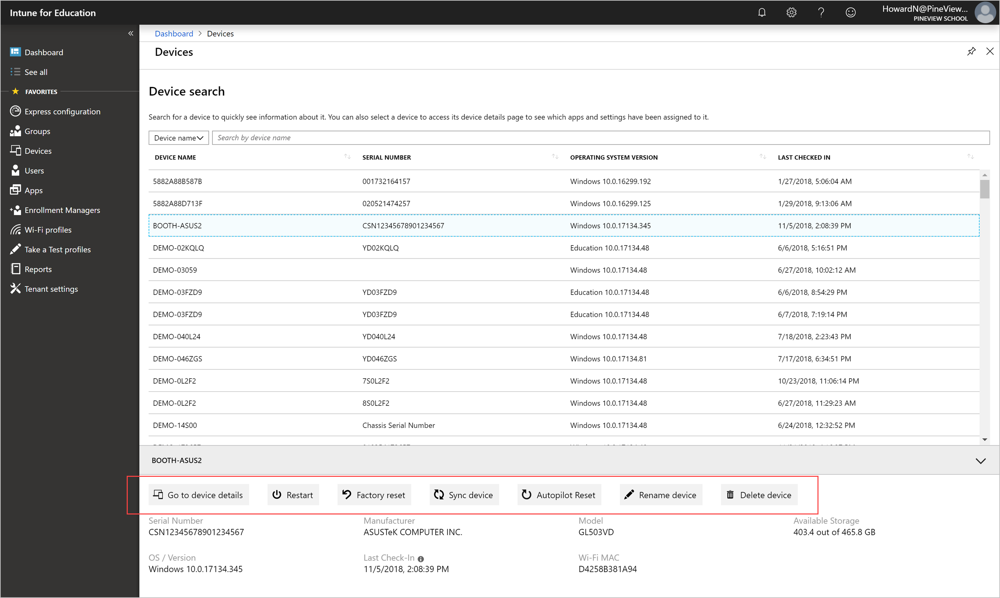
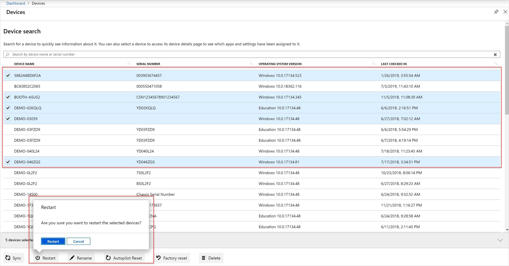
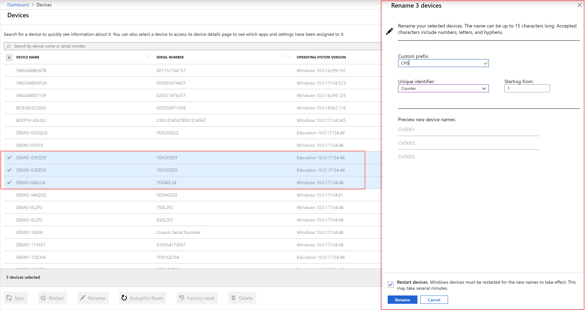

---
# required metadata

title: Remote device actions in Intune for Education
titleSuffix: Intune for Education
description: Learn how to use remote actions to troubleshoot and manage distant devices.
keywords:
author: lenewsad
ms.author: lanewsad
manager: dougeby
ms.date: 08/30/2019
ms.topic: article
ms.prod:
ms.service: microsoft-intune
ms.subservice: education
ms.technology:
ms.assetid: df7cabf2-1723-4817-b16c-800407a0c753
searchScope:
 - IntuneEDU

 # optional metadata

 #ROBOTS:
 #audience:
 #ms.devlang:
 #ms.reviewer: jordan
 #ms.suite: ems
 #ms.tgt_pltfrm:
 #ms.custom: intune-education

---

# Manage devices remotely  

If you're in a different location than a device or its user, and need to help them troubleshoot, use the remote actions in Intune for Education.  

## Remote actions for devices  

  

From the dashboard, go to **Devices**. Select the device that you want to manage. At the bottom of the page, select any of the following actions:

- **Restart**: Powers off the device and restarts it.
- **Factory reset**: Removes the device from Intune management and removes all data and settings from the device. 
- **Sync device**: Ensures that device has up-to-date settings, app assignments, and group memberships. This action can help if you're trying to troubleshoot a device.  
- **Autopilot Reset**: Removes all user data&ndash;including user-installed apps and personal settings&ndash;and keeps the Windows 10 device enrolled in Intune. The device is kept up-to-date with the latest apps, policies, and settings. A notification appears when the reset is initiated. The device resets the next time it connects to the internet.  
- **Rename device**: Gives the device a new name. The new name updates in Intune and locally, on the device. You must restart your Windows device for the new name to take effect.  
- **Delete device**: Unenrolls the device from Intune for Education and removes the device from Azure Active Directory. A deleted device can no longer access your school's resources.  

You can perform remote actions on a single device or in bulk on up to 100 devices at a time. To make a bulk selection, manually select devices from the devices list, or hold the Control or Command key to select multiple devices at once. 

   

To rename a group of devices, apply a naming template to them. Each device will be renamed with a custom prefix that's appended by a unique identifier, such as a serial number, a counter, or a Wi-Fi Mac address.  

   

## Remote actions for users  

From the dashboard, go to **Users**. Select the user that you want to manage. At the bottom of the page, select **Reset password**. This action resets an old, lost, or forgotten password on the user's device.  
